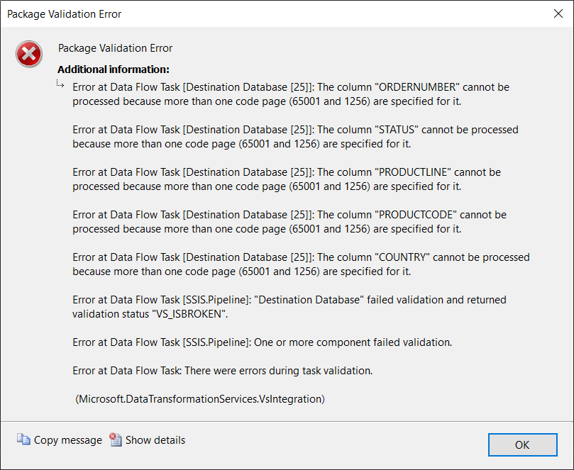
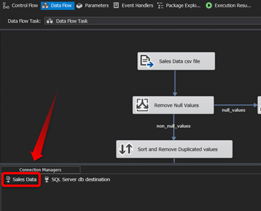
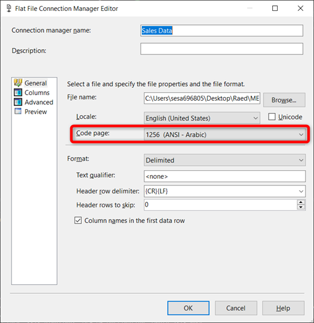

# ETL Pipeline Project using SQL Server Integration Services (SSIS)

This project focuses on extracting sales data from a CSV file, performing necessary data transformations, and loading it into a SQL Server database to serve as a data warehouse for further analysis.

## Project Overview

The goal of this project is to extract sales data from a CSV file and perform the following tasks using SQL Server Integration Services (SSIS):

### Data Source
- **Columns**: ORDERNUMBER, QUANTITYORDERED, PRICEEACH, STATUS, PRODUCTLINE, PRODUCTCODE, COUNTRY
- The data source is a CSV file containing the mentioned columns.

### Data Transformation
- **Data Cleaning**: Remove duplicated values in columns ORDERNUMBER and PRODUCTCODE. Remove null values in the PRICEEACH column.
- **Data Validation**: Ensure the accuracy, completeness, and consistency of the data. Check that the status values are from an expected list of statuses (Cancelled, Disputed, In Process, On Hold, Resolved, Shipped).
- **Data Enrichment**: Add additional columns for calculated fields such as the total sales amount for each order (Sales), which equals the quantity of products ordered multiplied by the price for each unit of the product.

### Destination
- The destination is a SQL Server database table named "sales" with the following columns: ORDERNUMBER, SALES, STATUS, PRODUCTLINE, PRODUCTCODE, COUNTRY.

### SSIS Pipeline Overview

The image below provides an overview of the SSIS pipeline created for the ETL process in this project. This pipeline is responsible for extracting sales data, performing data transformations, and loading it into the SQL Server database for further analysis.

## Running the Project

In order to run the code of this project, ensure that the following prerequisites are met:

1. **Visual Studio 2019**: Ensure that Visual Studio 2019 is installed on your machine.

2. **Download the Solution File**: Download the solution file "Sales ETL Pipeline.sln".

3. **Download and Unzip the Solution**: Download and Unzip the folder "Sales ETL Pipeline.7z".

4. **SQL Server**: SQL Server should be installed on your machine to act as the destination database.

Once you have the prerequisites in place, you can proceed with the following steps:

1. Open the file "Sales ETL Pipeline.sln" using Visual Studio 2019.

2. Execute the data flow within the solution to run the ETL process.

## Important Note on Data Loading
In SSIS, when attempting to load data into a specific destination, such as a SQL Server database, it's crucial to ensure that the code page of the input data matches the code page of the destination. Failure to do so may result in errors such as below. The solution to this issue is to align the source and destination with the same code page.

## Error Resolution
In this project, the source (a flat file) can be modified to match the destination (an OLE DB Destination step connecting to a SQL Server database) to avoid code page mismatch errors as follows:
1. Right click on the source in the connection manager’s window.

   
2. Choose Edit.
3. Select the suitable code page for the destination.

4. Press OK.
5. If it doesn’t work immediately, you need to save it and restart SSIS Solution.
